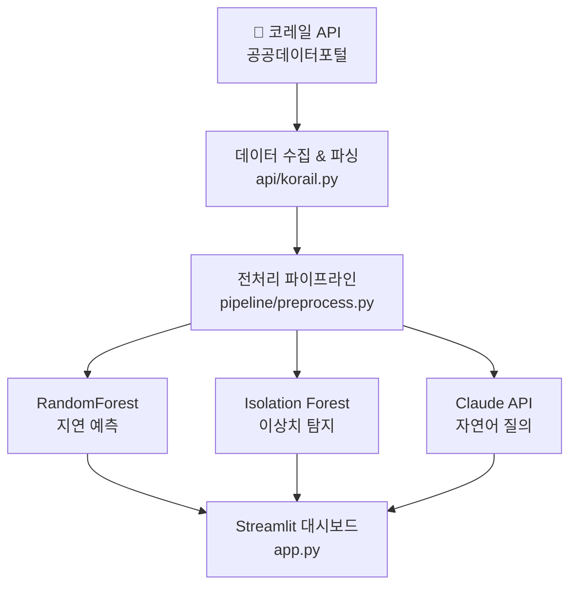
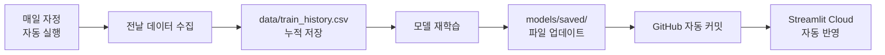
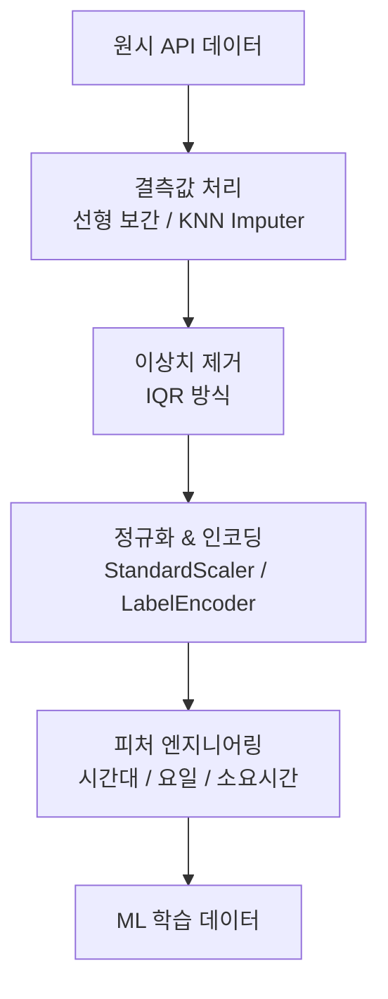

# 🚄 KTX 열차 지연 예측 대시보드

> 코레일 실시간 데이터 기반 ML 지연 예측 + Claude AI 자연어 질의 시스템

[](https://ktx-delay-predictor.streamlit.app)


---

## 📌 프로젝트 개요

공공데이터포털 코레일 API에서 실시간 열차 운행 데이터를 수집하고, 머신러닝 모델로 지연 여부를 예측하는 대시보드입니다. Claude API를 통해 자연어로 열차 정보를 질의할 수 있으며, GitHub Actions로 매일 자동으로 데이터를 수집하고 모델을 재학습합니다.

---

## 🏗️ 시스템 아키텍처



---

## 🔄 자동화 파이프라인 (GitHub Actions)



---

## 📊 전처리 파이프라인



---

## 🛠️ 기술 스택

| 분류        | 기술                                    |
| ----------- | --------------------------------------- |
| 데이터 수집 | 공공데이터포털 코레일 API               |
| 데이터 처리 | pandas, numpy, scikit-learn             |
| ML 모델     | RandomForestClassifier, IsolationForest |
| AI          | Claude API (anthropic)                  |
| 대시보드    | Streamlit, Plotly                       |
| 자동화      | GitHub Actions                          |
| 배포        | Streamlit Cloud                         |

---

## 📁 프로젝트 구조

```
ktx-delay-predictor/
├── .github/
│   └── workflows/
│       └── daily_train.yml     # 매일 자정 자동 실행
├── api/
│   ├── korail.py               # 코레일 운행정보 API
│   └── tago.py                 # TAGO 열차정보 API
├── pipeline/
│   ├── preprocess.py           # 전처리 파이프라인
│   └── features.py             # 피처 엔지니어링
├── models/
│   ├── train_model.py          # 모델 학습
│   └── saved/                  # 학습된 모델 저장
│       ├── random_forest.joblib
│       ├── isolation_forest.joblib
│       └── preprocessor.joblib
├── data/
│   └── train_history.csv       # 누적 학습 데이터
├── app.py                      # Streamlit 대시보드
├── scheduler.py                # 데이터 수집 & 재학습 스크립트
├── requirements.txt
└── .env                        # API 키 (gitignore)
```

---

## ✨ 주요 기능

### 1. 실시간 열차 현황

- 코레일 API에서 30초마다 자동 갱신
- 열차번호, 출발/도착역, 예정 시각, 지연 예측 결과 표시

### 2. ML 기반 지연 예측

- `RandomForestClassifier`로 지연 여부 예측
- 정상 / 소지연 (5~15분) / 대지연 (15분 이상) 3단계 분류
- 시간대, 요일, 노선, 상하행 등 10개 피처 활용

### 3. 이상치 탐지

- `IsolationForest`로 비정상적인 운행 패턴 자동 감지
- 이상치 스코어 분포 시각화

### 4. Claude AI 자연어 질의

- 현재 운행 데이터를 컨텍스트로 Claude API에 전달
- 자연어로 열차 정보 질의 가능
- 예: "오늘 지연 예측 요약해줘", "소지연 열차 몇 개야?"

### 5. 매일 자동 재학습

- GitHub Actions로 매일 자정 자동 실행
- 누적 데이터 기반으로 모델 재학습
- 데이터가 쌓일수록 예측 정확도 향상

---

## 🚀 실행 방법

### 로컬 실행

```bash
# 1. 레포 클론
git clone https://github.com/bird8696/ktx-delay-predictor.git
cd ktx-delay-predictor

# 2. 가상환경 생성 & 활성화
python -m venv venv
source venv/Scripts/activate  # Windows
source venv/bin/activate       # Mac/Linux

# 3. 패키지 설치
pip install -r requirements.txt

# 4. 환경변수 설정 (.env 파일 생성)
KORAIL_API_KEY=your_korail_api_key
TAGO_API_KEY=your_tago_api_key
ANTHROPIC_API_KEY=your_anthropic_api_key

# 5. 모델 학습
python models/train_model.py

# 6. 대시보드 실행
streamlit run app.py
```

---

## 📈 모델 성능

| 클래스     | 설명           |
| ---------- | -------------- |
| 0 - 정상   | 5분 미만 지연  |
| 1 - 소지연 | 5~15분 지연    |
| 2 - 대지연 | 15분 이상 지연 |

> 데이터가 누적될수록 소지연/대지연 예측 정확도가 향상됩니다.

---

## ⚠️ 한계점 및 개선 방향

- 현재 두 API가 서로 다른 날짜 데이터를 반환해 실시간 지연값 계산에 한계가 있음
- 데이터가 충분히 쌓인 후 모델 정확도가 의미 있는 수준으로 향상될 예정
- 향후 날씨 API 연동으로 기상 조건을 피처에 추가할 수 있음

---

## 📜 관련 자격증 & 기술

- AWS Certified Cloud Practitioner (CLF-C02)
- 정보처리기사 필기 합격
- 리눅스마스터 2급 필기 합격

---

## 👤 개발자

**Kim Taehyun** | IT 융합학부 컴퓨터정보보안 전공

- GitHub: [@bird8696](https://github.com/bird8696)

## 사이트 주소

https://ktx-delay-predictor.streamlit.app/
